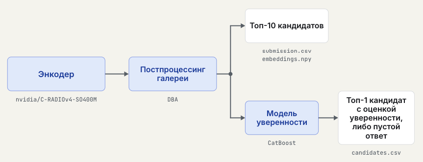
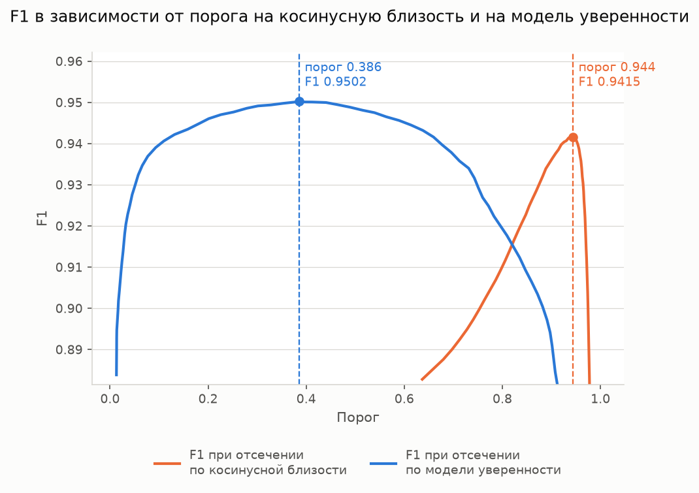
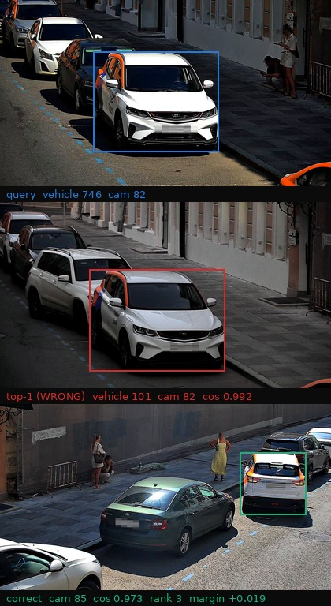
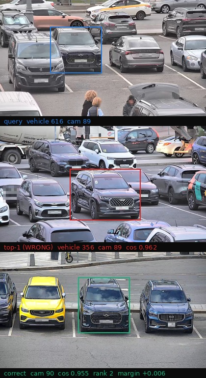
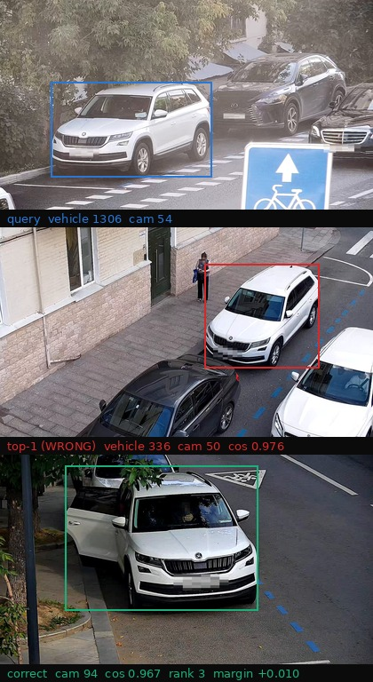
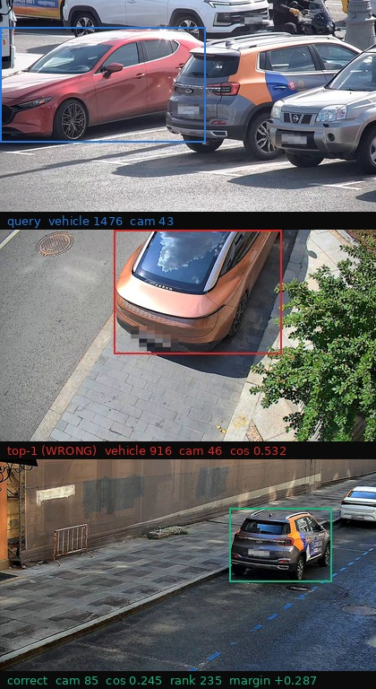
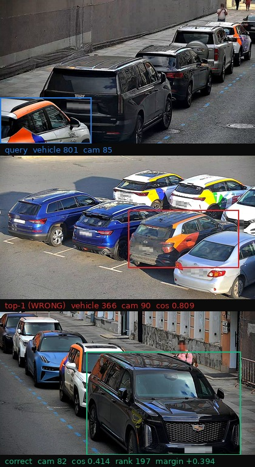
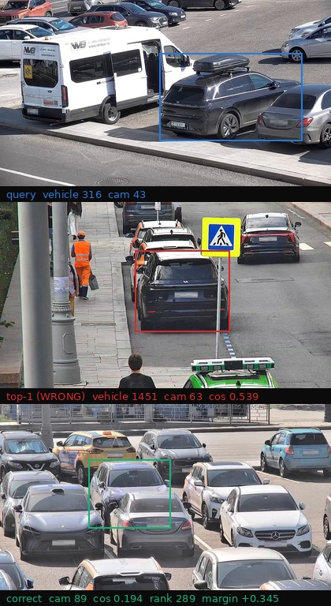

# ЛЦТ 2026. Сервис формирования цифрового признака ТС

Решение задачи реидентификации транспортных средств без привязки к номеру: по изображению автомобиля сервис формирует вектор-эмбеддинг, ранжирует по нему галерею и возвращает топ-10 кандидатов. Также реализован режим отказа: для топ-1 кандидата оценивается уверенность в совпадении; кандидат возвращается, только если уверенность превышает порог.

В README описаны архитектура решения, выбор и дообучение энкодера, постобработка галереи, модель уверенности и подбор порога, анализ ошибок, а также инструкции по запуску инференса в Docker и воспроизведению обучения.

**Основные метрики**

| Метрика | Значение |
|---|---|
| mAP@10 (валидация) | 0.9062 |
| Rank-1 (валидация) | 0.8872 |
| F1 режима предложения кандидатов (валидация) | 0.9502 |
| Latency (батч 1) | 16.5 мс |
| Пропускная способность (батч 32) | 134 FPS |
| Размер весов | 863 МБ |

Производительность замерялась на NVIDIA RTX 3090, Intel Core i5-13600K.

**Структура репозитория**

```text
├── inference/
│   ├── inference.py           # точка входа Docker-образа: формирует embeddings.npy, submission.csv, candidates.csv
│   ├── vehicle_encoder.py     # VehicleEmbedder — класс энкодера с методом extract() для эмбеддингов
│   └── benchmark.py           # замер latency / FPS
├── train/
│   ├── train.sh               # полный пайплайн обучения
│   ├── encoder/               # дообучение энкодера (config.yaml, model.py, data_module.py, train.py)
│   └── confidence_model.py    # обучение модели уверенности и подбор порога
├── docs/                      # иллюстрации к README
├── data/                      # данные (не хранятся в git)
├── models/                    # веса энкодера и модели уверенности (не хранятся в git, создаются в процессе обучения)
├── output/                    # результаты работы решения на тестовой выборке: embeddings.npy, submission.csv, candidates.csv
├── Dockerfile
├── pyproject.toml, uv.lock    # зависимости с зафиксированными версиями
└── README.md
```

## Архитектура решения

Решение включает в себя:

- модель-энкодер для формирования вектора-эмбеддинга по фотографии автомобиля;
- алгоритм постобработки эмбеддингов изображений галереи;
- модель для оценки уверенности в лучшем отобранном кандидате.

С помощью модели-энкодера рассчитываются эмбеддинги фотографии-запроса и всех объектов галереи. Эмбеддинги галереи дополнительно постобрабатываются. Для запроса извлекаются топ-10 объектов галереи по косинусной близости эмбеддингов — эти объекты формируют `submission.csv`.

Для топ-1 объекта рассчитываются дополнительные признаки и применяется модель уверенности. Если скор модели уверенности превышает определенный порог, кандидат считается подтвержденным и попадает в `candidates.csv`. В противном случае считаем, что совпадений в галерее нет.



## Модель-энкодер для формирования вектора-эмбеддинга по фотографии автомобиля

Ключевая модель в решении, получена путем дообучения открытой модели [nvidia/C-RADIOv4-SO400M](https://huggingface.co/nvidia/C-RADIOv4-SO400M).

### Выбор backbone

В рамках работы над задачей тестировалось дообучение различных открытых моделей, как общего назначения, так и предобученных под задачу реидентификации автомобилей.

Среди моделей, заточенных под задачу реидентификации автомобилей, лучшее качество показала модель [apatc/vehicle_reid_siglip2_naflex_512d](https://huggingface.co/apatc/vehicle_reid_siglip2_naflex_512d).

Среди моделей общего назначения лучше всего себя показали модели из семейств SigLIP2 от Google и RADIO от NVIDIA. Эти модели обошли по качеству apatc/vehicle_reid_siglip2_naflex_512d, вероятнее всего, за счет размера. За счет увеличения размера backbone возможен и дальнейший рост качества решения, однако начнут ухудшаться показатели производительности.

Исходя из максимизации качества модели при обеспечении производительности на уровне 100 FPS в целевой системе, была выбрана nvidia/C-RADIOv4-SO400M с разрешением входных изображений 368×272.

Сравнение некоторых протестированных backbone — в таблице ниже.

| Model | Resolution / patches | Tokens | Weights (fp32) | mAP@10 (after DBA) | Best FPS |
|---|---|---|---|---|---|
| apatc/vehicle_reid_siglip2_naflex_512d | ≤480 patches | ≤480 | 373 MB | 0.8665 | — |
| apatc/vehicle_reid_siglip2_naflex_512d | ≤640 patches | ≤640 | 373 MB | 0.8643 | 250.1 |
| nvidia/C-RADIOv4-SO400M | 272×208 | 221 | 1725 MB | 0.8945 | — |
| nvidia/C-RADIOv4-SO400M | 304×224 | 266 | 1725 MB | 0.8984 | — |
| **nvidia/C-RADIOv4-SO400M** | **368×272** | **391** | **1725 MB** | **0.9062** | **134.4** |
| nvidia/C-RADIOv4-SO400M | 384×288 | 432 | 1725 MB | 0.9056 | 122.2 |
| google/siglip2-large-patch16-256 | 256×256 | 256 | 1264 MB | 0.8903 | 126.5 |
| apatc/vehicle_reid_siglip2_naflex_512d + nvidia/C-RADIOv4-SO400M | 640 patches + 272×208 | 640 + 221 | 2098 MB | 0.8977 | 123.1 |
| apatc/vehicle_reid_siglip2_naflex_512d + nvidia/C-RADIOv4-SO400M | 480 patches + 304×224 | 480 + 266 | 2098 MB | 0.9031 | 125.7 |
| apatc/vehicle_reid_siglip2_naflex_512d + google/siglip2-large-patch16-256 | 640 patches + 256×256 | 640 + 256 | 1637 MB | 0.8954 | 126.5 |

### Дообучение

Дообучение проводилось с помощью ArcFace loss. ArcFace loss регулярно встречается в лучших решениях ML-соревнований, связанных с формированием эмбеддингов объектов в совершенно разных доменах — изображения животных, текстовые описания вакансий, музыкальные треки.

Детали:

- дообучение проводилось на предоставленном организаторами датасете, внешние данные не использовались;
- использовался только кусок кадра, содержащий автомобиль, не весь кадр;
- перед началом дообучения веса ArcFace-головы инициализировались средними эмбеддингами соответствующего ТС по изображениям из обучающей выборки;
- применялись аугментации;
- разный learning rate для разных слоев — наибольший для ArcFace-головы, меньше для backbone, еще меньше для нижних слоев backbone.

Дообучение позволило значительно повысить качество модели на целевом датасете: **0.55 → 0.8935 mAP**.

### Валидация

Предоставленные данные были разбиты на 5 фолдов по vehicle_id.
Из ТС, вошедших в фолд, формировались запросы и галерея: одно изображение на каждую комбинацию ТС-камера - в галерею, остальные в запросы. Такой протокол и размер фолдов выбран исходя из анализа public test. Таргетировалась метрика mAP@10, с предварительным исключением фотографий того же ТС с той же камеры, что и в запросе.

### Производительность

Выбранная модель укладывается в оптимальные требования по производительности:

- размер весов — 863 МБ (431M параметров, чекпойнт сохраняется в bf16);
- latency — 16.5 мс (из них 6 мс — загрузка и подготовка изображения, 10.5 мс — модель);
- FPS — 134 (батч 32);
- пиковое потребление видеопамяти — 1.24 ГБ.

Замеры проводились на системе с NVIDIA RTX 3090, Intel Core i5-13600K.

## Алгоритм постобработки эмбеддингов изображений в галерее

Использовалась техника DBA (database-side augmentation): для каждого изображения в галерее ищется ближайший сосед, и эмбеддинг изображения взвешивается с эмбеддингом ближайшего соседа с весом, пропорциональным их схожести.

Это позволило повысить качество ранжирования на **0.013 mAP (0.8935 → 0.9062)**.

## Модель для оценки уверенности в лучшем отобранном кандидате

Вероятность, что лучший кандидат из галереи — действительно тот же автомобиль, что и в запросе, зависит не только от похожести запроса и кандидата, но и от параметров галереи: сколько всего в ней изображений, сколько похожих на данный запрос, насколько первый кандидат выделяется среди них. В связи с этим для оценки уверенности была построена дополнительная небольшая модель, учитывающая эти факторы.

**Формирование обучающей выборки.** Сэмплировались запросы и галереи разного состава со следующими параметрами:

- 300 автомобилей в галерее;
- одно изображение от каждой пары камера-автомобиль в галерее, остальные — в запросах;
- 20% запросов — без верных кандидатов в галерее.

Для каждого запроса сохранялся лучший кандидат из галереи (по косинусной близости эмбеддингов с учетом DBA), фичи и целевая переменная (1 — первый кандидат тот же автомобиль, что и запрос; 0 — иначе).

Для реального применения имеет смысл обучить модель на галерее с реальными параметрами (количество автомобилей в галерее, количество фотографий на один автомобиль и т.д.). Мы не стали симулировать разнообразные галереи в связи с небольшим количеством автомобилей в предоставленных данных (большую часть которых при этом требуется оставить на обучение энкодера) и преследовали цель скорее показать концепцию такой модели.

Для отбора топ-1 кандидата и расчета фичей использовались out-of-fold эмбеддинги:

Энкодер обучается на фолдах 0, 1, 2 → сохраняет эмбеддинги для фолдов 3, 4 → на этих фолдах сэмплируются запросы и галереи, обучается модель уверенности и подбирается порог.

Энкодер обучается на фолдах 0, 3, 4 → сохраняет эмбеддинги для фолдов 1, 2 → на этих фолдах сэмплируются запросы и галереи, применяется модель уверенности и порог, и оценивается эффект от данной модели (в сравнении с отсечением просто по косинусной близости).

**Переменные и модель.**

Использовался CatBoost, бинарная классификация, 60 деревьев, 3 переменные:

- косинусная близость запроса и топ-1 кандидата (без DBA);
- софтмакс топ-1 кандидата по топ-50 галереи (температура 0.05) — насколько первый кандидат выделяется среди остальных;
- косинусная близость запроса и топ-2 кандидата.

**Результаты.**

Отсечение просто по косинусной близости даёт F1 0.9415, отсечение по модели уверенности — **F1 0.9502 (+0.0087)**. Кроме прироста качества, модель уверенности даёт более пологий оптимум: F1 слабо меняется на широком диапазоне порогов, тогда как по косинусной близости пик более узкий и легче промахнуться на галереях с другими параметрами.

Подобранные на фолдах 3, 4 пороги: 0.3858 по модели уверенности и 0.9441 по косинусной близости. Порог берётся как центр плато F1 (медиана точек сетки в пределах 1e-4 от максимума), а не как argmax: у пологого пика argmax садится на его левый край и уезжает по плато от численного шума в признаках.



Обучение модели уверенности и подбор порога — `train/confidence_model.py`.

## Анализ ошибок

**Подход.** Применили модель к валидационной выборке, для каждого запроса отобрали топ-1 кандидата и оставили случаи, где кандидат неправильный. К каждому такому случаю добавили изображение правильного кандидата из галереи и разобрали кейсы вручную. Ошибки разделились в пропорции примерно **80/20**: 80% — у кандидата совпадают модель и цвет с запросом, 20% — ошибочная разметка.

**Совпадают модель и цвет (~80%).** Чаще всего с такими случаями ничего сделать нельзя: на кадре два визуально идентичных автомобиля. Иногда отличить их можно по дизайну дисков или наличию наклеек на лобовом стекле (пример 2). Скорее всего, при более длительном обучении на большем датасете модель научится улавливать такие детали.

На картинках ниже: сверху — запрос, в середине — ошибочный топ-1, снизу — правильный кандидат из галереи с его рангом и отставанием по косинусной близости. Зачастую правильный кандидат стоит на 2-3 месте и проигрывает сотые доли.

| Пример 1 | Пример 2 | Пример 3 |
|---|---|---|
|  |  |  |

**Ошибки разметки (~20%).** Судя по всему, разметка отталкивалась от номера: в кадре присутствует номер нужного автомобиля, но рамкой выделен другой автомобиль. Примеры:

1. в запросе выделена красная машина, на самом деле имеется в виду каршеринговый автомобиль;
2. в запросе выделен каршеринговый автомобиль, на самом деле имеется в виду Cadillac;
3. в запросе выделен Li Xiang, имеется в виду Mercedes — в галерее он также выделен неправильно.

| Пример 1 | Пример 2 | Пример 3 |
|---|---|---|
|  |  |  |

В отличие от случаев выше, здесь правильный кандидат оказывается далеко внизу списка (ранг 235, 197 и 289) и проигрывает по косинусной близости 0.29-0.34 — модель уверенно находит именно тот автомобиль, который выделен в запросе.

## Как запустить inference

Инференс запускается в Docker. Веса энкодера и модели уверенности находятся внутри образа, при запуске интернет не нужен. Для инференса требуется GPU.

1. Скачать образ из Docker Hub:

```bash
docker pull madxx31/lct-vehicle-reid:v1
```

2. Запустить без сети:

```bash
docker run --rm --gpus all --network none \
  --user $(id -u):$(id -g) \
  -v /путь/к/данным:/data:ro \
  -v "$PWD/output":/output \
  madxx31/lct-vehicle-reid:v1
```

В `/путь/к/данным` должны лежать `test_query.csv`, `test_gallery.csv` и `images/<image_id>.jpg`. В `output/` записываются `embeddings.npy`, `submission.csv` и `candidates.csv`. В `embeddings.npy` сначала идут эмбеддинги запросов, затем галереи (в порядке строк `test_query.csv` и `test_gallery.csv`); эмбеддинги галереи сохраняются после постобработки DBA. `--user` нужен, чтобы файлы принадлежали текущему пользователю, а не root.

Параметры (дописываются в конец команды): `--batch-size` (по умолчанию 32), `--num-threads` — потоки декодирования изображений (32).

### Оценка производительности

Замер производительности (latency, FPS) запускается в том же образе:

```bash
docker run --rm --gpus all --network none --entrypoint python \
  -v /путь/к/данным:/data:ro \
  madxx31/lct-vehicle-reid:v1 -m inference.benchmark
```

Можно заменить скрипт замера на собственный: он должен импортировать `VehicleEmbedder` и вызывать `extract()` со списком `{"image_path": ..., "bbox": [x, y, w, h]}`:

```python
from inference.vehicle_encoder import VehicleEmbedder
model = VehicleEmbedder()
emb = model.extract([{"image_path": "/data/images/<image_id>.jpg", "bbox": [x, y, w, h]}])
```

```bash
docker run --rm --gpus all --network none --entrypoint python \
  -v /путь/к/данным:/data:ro -v "$PWD/my_benchmark.py":/app/my_benchmark.py:ro \
  madxx31/lct-vehicle-reid:v1 my_benchmark.py
```

## Как воспроизвести обучение

Скрипты обучения упрощены: они воспроизводят только итоговые веса энкодера и модели уверенности. Валидация энкодера (расчет mAP@10 и Rank-1) и эксперименты (сравнение backbone, подбор гиперпараметров, оценка эффекта DBA) в репозиторий не включены.

Обучение запускается не в Docker, а в локальном окружении [uv](https://docs.astral.sh/uv/). Требуется GPU с 24+ ГБ памяти и доступ в интернет.

```bash
git clone https://github.com/madxx31/lct-vehicle-reid.git && cd lct-vehicle-reid
# положить данные: data/train.csv и data/images/<image_id>.jpg
uv sync
bash train/train.sh
```

В рамках `train/train.sh`:

- обучается энкодер на двух разных train/val разбиениях и сохраняются out-of-fold эмбеддинги в `oof_preds/`;
- обучается энкодер на всех данных и сохраняются веса (`models/vehicle_encoder.pt`);
- обучается и сохраняется модель уверенности (`models/confidence_model.cbm`) с использованием out-of-fold эмбеддингов и подбирается порог; подобранный порог выводится в консоль; также перезаписывается график `docs/confidence_thresholds.png`.

На RTX 3090 обучение занимает около 2.5 часов.

После того как чекпойнты сохранены в `models/`, можно собрать собственный Docker-образ (сборке нужен интернет) и запускать его так же, как описано выше.
